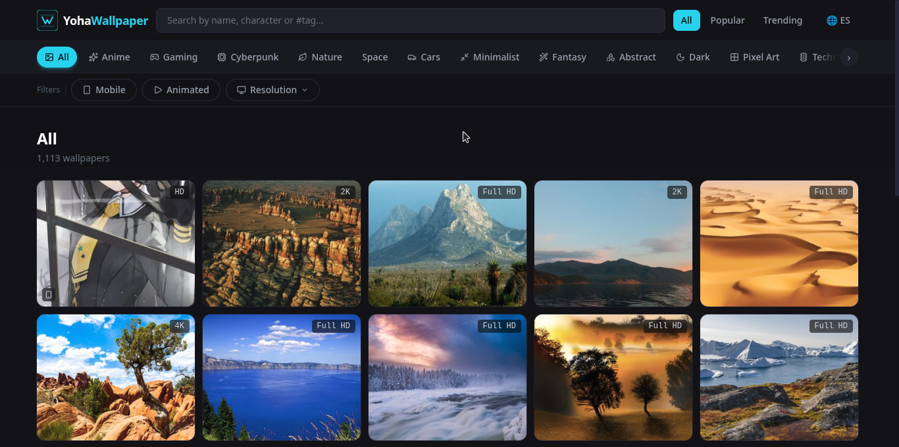
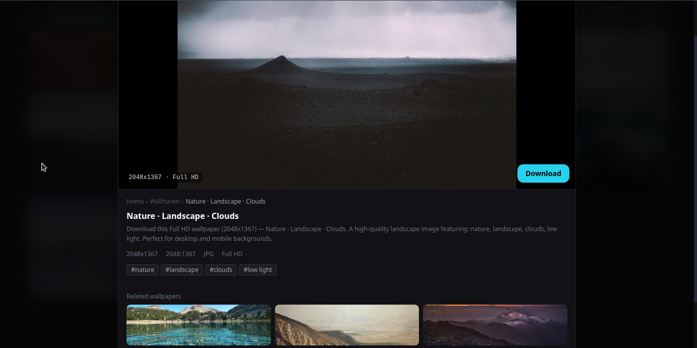
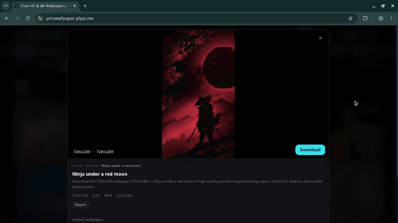
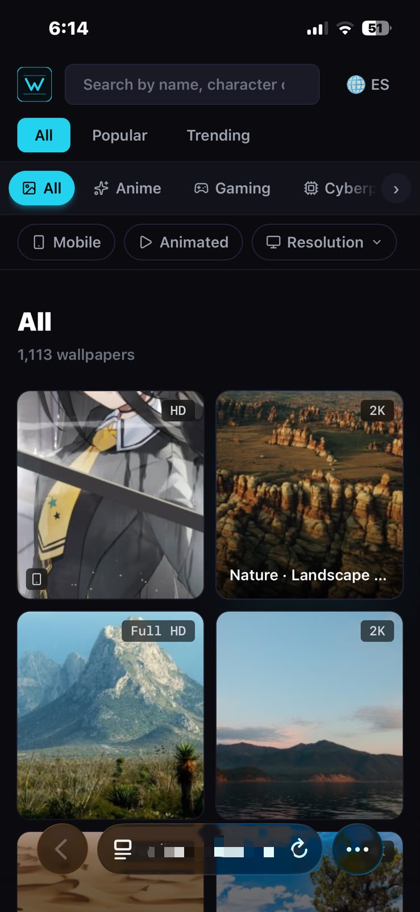
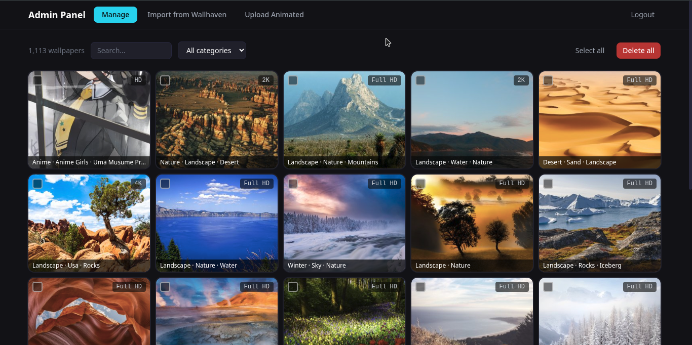

<div align="center">

# 🖼️ YohaWallpaper

**A curated wallpaper platform featuring high-quality static wallpapers from Wallhaven and original animated wallpapers.**

[](https://yohawallpaper.plyos.me)
[](https://api.plyos.me/docs)
[](LICENSE)
[](https://yohawallpaper.plyos.me)

<!--    -->
<!-- 💡 Tip: usa una captura panorámica del grid en desktop, o un collage de 3-4 wallpapers destacados -->

</div>

---

## ✨ Features

- 🎨 **1,100+ wallpapers** — static from Wallhaven + original animated (MP4/WebM)
- 🎬 **Animated wallpapers** — play in-browser with a LIVE badge, stored on Cloudflare R2
- 🔍 **Smart search** — auto-translates Spanish queries to English (deep-translator)
- 🗂️ **19 categories** — Anime, Gaming, Cyberpunk, Nature, Space, Cars, and more
- 📐 **Resolution filter** — Full HD / 2K / 4K
- 📱 **Mobile filter** — browse portrait-oriented wallpapers
- 🌐 **EN / ES toggle** — Google Translate integration with language cookie fix
- 🔗 **SEO ready** — dynamic sitemap, meta tags, Google Search Console verified
- 🛡️ **Admin panel** — import from Wallhaven, upload animated, manage & edit wallpapers

---

## 📸 Screenshots

### Home — Wallpaper Grid

<!-- Grid desktop con los badges de resolución y LIVE visibles -->

### Wallpaper Modal

<!-- Modal abierto mostrando tags, botón de descarga e imagen/video en grande -->

### Animated Wallpaper (LIVE)

<!-- Card con badge LIVE y/o el video reproduciéndose en el modal -->

### Mobile View

<!-- Vista móvil del grid con el footer colapsado -->

### Admin Panel

<!-- Tab Manage o Import del admin -->

---

## 🛠️ Tech Stack

| Layer | Tech |
|---|---|
| **Frontend** | React 18 · Vite · Tailwind CSS v3 · Axios · Lucide React · React Router |
| **Backend** | Python 3.13 · FastAPI · SQLModel · SQLite · slowapi · deep-translator · boto3 |
| **Storage** | Cloudflare R2 (animated wallpapers) |
| **Hosting** | Fly.io (backend) · Vercel (frontend) |
| **Domain** | Porkbun → plyos.me |

---

## 🚀 Getting Started

### Prerequisites

- Python 3.13+
- Node.js 20+
- A [Wallhaven API key](https://wallhaven.cc/settings/account)
- Cloudflare R2 bucket (for animated wallpapers)

### Clone the repo

```bash
git clone https://github.com/yohangaitan/YohaWallpaper.git
cd YohaWallpaper
```

### Backend

```bash
# Create and activate virtual environment
python3 -m venv venv
source venv/bin/activate        # bash/zsh
source venv/bin/activate.fish   # fish

# Install dependencies
cd backend
pip install -r requirements.txt

# Configure environment variables
cp .env.example .env
# Edit .env with your keys (see Environment Variables section)

# Run development server
uvicorn app.main:app --reload
# API available at http://localhost:8000
```

### Frontend

```bash
cd frontend
npm install
npm run dev
# App available at http://localhost:5173
```

---

## ⚙️ Environment Variables

Create a `.env` file inside the `backend/` folder:

```env
WALLHAVEN_API_KEY=your_wallhaven_api_key
ADMIN_TOKEN=your_secret_admin_token

# Cloudflare R2
R2_ACCESS_KEY_ID=your_r2_access_key
R2_SECRET_ACCESS_KEY=your_r2_secret_key
R2_BUCKET_NAME=your-bucket-name
R2_ACCOUNT_ID=your_cloudflare_account_id
R2_PUBLIC_URL=https://pub-xxxx.r2.dev

# CORS
APP_CORS_ORIGINS=http://localhost:5173
```

---

## 📡 API Reference

Base URL: `https://api.plyos.me`

| Method | Endpoint | Description |
|---|---|---|
| `GET` | `/api/v1/wallpapers` | List wallpapers (paginated, filterable) |
| `GET` | `/api/v1/wallpapers/{id}` | Get single wallpaper |
| `GET` | `/api/v1/wallpapers/{id}/download` | Redirect to original file |
| `GET` | `/api/v1/wallpapers/categories` | List all categories |
| `GET` | `/api/v1/wallpapers/sitemap.xml` | Dynamic sitemap |

**Query params for `/wallpapers`:** `q`, `category_id`, `media_type`, `resolution`, `orientation`, `sort`, `page`, `per_page`

> Full interactive docs available at [`/docs`](https://api.plyos.me/docs)

---

## 🗂️ Project Structure

```
YohaWallpaper/
├── backend/
│   ├── app/
│   │   ├── api/v1/
│   │   │   ├── wallpapers.py     # Public wallpaper endpoints
│   │   │   ├── admin.py          # Admin endpoints (token-protected)
│   │   │   └── animated.py       # Animated wallpaper upload/delete
│   │   ├── models/wallpaper.py
│   │   ├── schemas/wallpaper.py
│   │   ├── services/
│   │   │   ├── fetcher.py        # Wallhaven API integration
│   │   │   └── r2.py             # Cloudflare R2 client
│   │   ├── config.py
│   │   ├── database.py
│   │   └── main.py
│   ├── Dockerfile
│   ├── fly.toml
│   └── requirements.txt
└── frontend/
    ├── src/
    │   ├── components/           # Navbar, FilterBar, WallpaperCard, Modal, etc.
    │   ├── pages/                # Home, AdminPage
    │   ├── services/api.js       # Axios API client
    │   └── hooks/useSEO.js       # Dynamic meta tags
    ├── index.html
    └── vercel.json
```

---

## 🚢 Deployment

### Backend (Fly.io)

```bash
cd backend
fly deploy -a yohawallpaper-api
```

### Frontend (Vercel)

Push to `main` — Vercel auto-deploys via GitHub integration.

---

## ❓ FAQ

**Where do the wallpapers come from?**  
Static wallpapers are fetched from [Wallhaven](https://wallhaven.cc) via their public API. Animated wallpapers (.mp4 / .webm) are original content created and hosted by YohaWallpaper on Cloudflare R2.

**Can I download wallpapers for personal use?**  
Yes. Static wallpapers are subject to Wallhaven's licensing — check each wallpaper's source for details. Animated wallpapers are original content by YohaWallpaper.

**How does the search work?**  
The search bar accepts queries in English or Spanish. If you type in Spanish, the backend automatically translates it to English before querying (powered by `deep-translator`), so results are consistent regardless of the language you use.

**How do I access the admin panel?**  
The admin panel lives at `/admin` and requires a secret token. It's intended for the site owner only. If you're running your own instance, set `ADMIN_TOKEN` in your `.env` file.

**The API is returning `stopped` / not responding — what do I do?**  
The backend runs on Fly.io. If the machine is stopped, restart it with:
```bash
fly machines start 83dde9b76d1908 -a yohawallpaper-api
```

**Can I contribute?**  
This is currently a personal project, but feel free to open an issue if you find a bug or have a suggestion.

---

## 🙏 Credits

- Static wallpapers courtesy of [Wallhaven](https://wallhaven.cc)
- Animated wallpapers original content by YohaWallpaper

---

<div align="center">
Made with ☕ by <a href="https://plyos.me">Yohan Gaitan</a>
</div>
